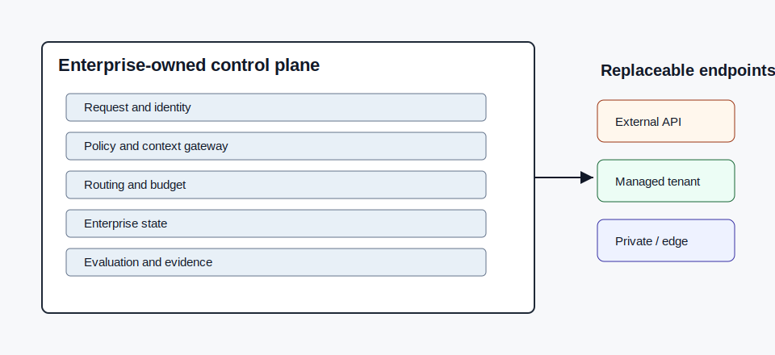

# Model-Swap Test

**Govern the capability, not the model.** A diagnostic harness that decides whether you can replace the model behind an AI feature without redoing your security and compliance review.

The thesis: the durable asset is the *capability contract* — the eval set, the acceptance criteria, and the definition of an unacceptable failure. The model is a swappable component that must requalify against that contract before it ships. A capability passes the Model-Swap Test when its endpoint can be replaced while preserving the business capability within an acceptable recovery window.

This repo does not recommend a provider. It asks whether the assets needed to requalify a substitute actually exist — prompts, policies, eval evidence, tool contracts, fallback procedures, and acceptance criteria — and then measures a candidate against the incumbent on the capability's own bar. See [docs/model-swap-test.md](docs/model-swap-test.md) for the concept in full and [docs/reference-architecture.md](docs/reference-architecture.md) for how it maps to the code.

> **Note on data:** the bundled PHI eval set (`evals/phi-classification.jsonl`) is fully synthetic. Names, dates, and identifiers were invented for this repo and contain no real PHI.

## What it measures

Each candidate is scored against the **incumbent as a live baseline**, not just a static threshold:

- **Accuracy with a 95% confidence interval.** At eval-scale sample sizes a point estimate is misleading, so the Wilson interval travels with every score and the report flags verdicts the sample is too small to support.
- **Critical-class recall.** For safety-shaped capabilities, a missed positive matters more than overall accuracy. The harness surfaces recall on the capability's declared critical class (e.g. PHI caught / PHI present).
- **Cost and token usage.** Real per-run spend, measured from the provider's own usage counts, with the delta against the incumbent.
- **Recovery window.** Estimated time to requalify and cut over.
- **Endpoint health pre-flight.** Unreachable endpoints are reported as *unavailable*, never as a quality failure.

## 60-Second Demo

No credentials or local model server required:

```bash
python3.11 -m venv .venv
. .venv/bin/activate
pip install -e ".[dev]"
mst run profiles/capabilities/phi-classification.yaml --incumbent mock --candidate mock-degraded
```

Expected shape:

```text
Overall verdict: NOT_SWAPPABLE

Endpoint        Role        Verdict         Accuracy (95% CI)   Critical recall   Eval cost   Blocking reasons
mock            incumbent   SWAPPABLE       1.00 [0.81-1.00]    7/7 (1.00)        $0.0000     none
mock-degraded   candidate   NOT_SWAPPABLE   0.88 [0.64-0.97]    5/7 (0.71)        $0.0000     accuracy below threshold; false negatives on direct identifiers

⚠ mock-degraded: accuracy 0.88 is within the margin of error of the 0.90 threshold (95% CI 0.64-0.97, n=16) — collect more eval examples to confirm
```

The point of the demo is not that the mock model is bad. The point is that the harness can prove whether a substitute clears the capability's own acceptance criteria — and is honest about how much confidence a small eval set actually supports.

## Running Real Endpoints

Copy the environment template:

```bash
cp .env.example .env
```

Configure `ANTHROPIC_API_KEY` for the hosted adapter and make sure Ollama is running locally for the local adapter. Endpoint names and model identifiers live only in [profiles/models.profile.yaml](profiles/models.profile.yaml).

```bash
mst run profiles/capabilities/phi-classification.yaml --incumbent anthropic-default --candidate ollama-local
```

Local scores may be lower. That is part of the test: a substitute is only acceptable when it clears the business capability's measured bar, not when it feels directionally similar.

Per-token pricing lives next to each endpoint in [profiles/models.profile.yaml](profiles/models.profile.yaml) (`price_per_1k_input` / `price_per_1k_output`). Token counts come from each provider's own usage data, so the eval-cost column and the cost delta against the incumbent are measured, not estimated. Local endpoints report token volume at zero cost.

## Durable vs Refreshable

The repo intentionally separates durable capability logic from refreshable endpoint details:

- `core/` is durable. It contains the interface contracts, evaluator, swap-test engine, and scorecard. It contains no model names.
- `adapters/` is refreshable. It knows how to call specific endpoint families.
- `profiles/models.profile.yaml` is refreshable. It is the only place endpoint ids, hosts, and model identifiers belong.
- `profiles/capabilities/` defines business capabilities, acceptance criteria, fallback procedures, policy constraints, and eval references.
- `evals/` contains acceptance evidence. Without an eval set, the capability is `NOT_SWAPPABLE`.

## Architecture



A full **[reference architecture](docs/reference-architecture.md)** maps each layer below to the modules that implement it, marks what is implemented vs. aspirational, and shows the runtime flow of a swap test.

| Layer | Responsibility | Failure controlled |
|---|---|---|
| Request and identity | Authenticate actor, purpose, consent, and data class | Unauthorized or context-free execution |
| Policy and context gateway | Apply authorization, minimization, retrieval, and injection controls | Data leakage and unsafe context assembly |
| Routing and budget | Select an approved endpoint and fallback path | Provider lock-in and overuse of costly models |
| Enterprise state | Retain workflow state, curated corrections, and approvals | Loss of institutional learning |
| Evaluation and evidence | Measure quality and retain traces, tests, and audit evidence | Unmeasured degradation |
| Tool and action boundary | Constrain credentials, actions, transactions, and checkpoints | Excessive or irreversible agent action |

## CLI

```bash
mst list
mst validate profiles/capabilities/phi-classification.yaml
mst run profiles/capabilities/phi-classification.yaml --incumbent mock --candidate mock-degraded
mst run profiles/capabilities/phi-classification.yaml --incumbent mock --candidate mock-degraded --json
```

Reports are printed to the terminal and written as `<capability>.report.json`. Route records for eval calls are written to `.mst-state/routes.jsonl`.

## Extending It

The control-plane seam is deliberate:

- Implement `PolicyGate` when request authorization and endpoint eligibility need to be enforced before routing.
- Replace the JSONL `EnterpriseState` with a database, event stream, warehouse, or governed evidence store.
- Add capabilities under `profiles/capabilities/` and eval sets under `evals/`.
- Add endpoint adapters without changing `core/`.

## Roadmap

- Multi-capability runs: point the harness at a directory of capabilities and emit a portfolio swap verdict.
- Parallel candidate scoring for larger eval sets.
- Pluggable scorers beyond exact-label classification (extraction, ranking, judged free-text).

## Sources and Attribution

The Model-Swap Test framing and this implementation are original work. Routing literature that informed the broader thinking includes FrugalGPT, RouteLLM, and calibrated cascade-routing work; this repo does not claim results from that research.

Licensed under Apache-2.0.
