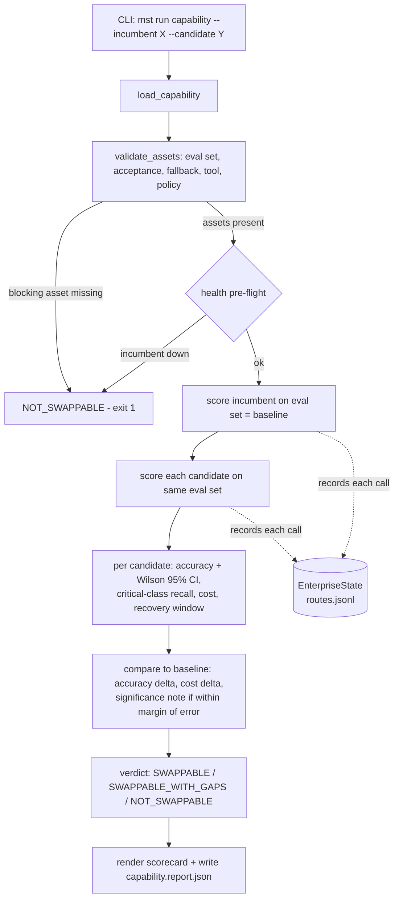

# Reference Architecture

This document is the bridge between the conceptual control plane in the README and
the code in this repository. It states **what each layer is for**, **which module
implements it**, and **how complete that implementation is** — so the architecture is
read as a roadmap, not a promise.

## Design principle: durable core, refreshable edges

The system is split so that the things that change often (models, prices, hosts) never
force a change to the things that must stay stable (the capability contract and the
requalification logic).

- **Durable** — `core/`: contracts, evaluator, swap-test engine, scorecard, statistics.
  Contains no model or provider names. This is enforced in CI by the `core-purity` job.
- **Refreshable** — `adapters/` (how to call an endpoint family) and
  `profiles/models.profile.yaml` (endpoint ids, hosts, model identifiers, pricing).
- **Contract** — `profiles/capabilities/*.yaml` and `evals/*.jsonl`: the governed asset.
  A capability is judged against *its own* acceptance criteria, never against the
  incumbent's output style.

```
profiles/capabilities/  ── the governed contract (eval set, thresholds, critical class)
        │
        ▼
core/  ── durable engine: evaluate → score (accuracy + CI, recall, cost) → verdict
        │  (knows nothing about any specific model)
        ▼
adapters/ + profiles/models.profile.yaml  ── refreshable: how to call a model, what it costs
```

## Control-plane layers → modules → status

The README presents six enterprise control-plane layers. This harness deliberately
implements the **evaluation, evidence, and routing-input** layers deeply, and leaves the
request-time enforcement layers as typed seams. The table is the honest map.

| # | Control-plane layer | Responsibility | Implemented by | Status |
|---|---|---|---|---|
| 1 | Request & identity | Authenticate actor, purpose, consent, data class | — | **Not implemented** (seam: `ClassifiedRequest`) |
| 2 | Policy & context gateway | Authorization, minimization, injection controls | `PolicyGate` protocol in `core/contracts.py` | **Stub** (interface only) |
| 3 | Routing & budget | Select an approved endpoint; measure cost; fallback | `adapters/factory.py`, `core/swap_test.py`, pricing in profile | **Partial** — selection + cost/CI scoring; no live fallback execution |
| 4 | Enterprise state | Retain route records, corrections, approvals | `core/state.py` (`JsonlEnterpriseState`) | **Implemented** (JSONL; swappable for a DB/warehouse) |
| 5 | Evaluation & evidence | Measure quality; retain traces and audit evidence | `core/evaluator.py`, `core/scorecard.py`, `core/stats.py` | **Implemented** — accuracy + Wilson 95% CI, critical-class recall, cost, JSON report |
| 6 | Tool & action boundary | Constrain credentials, actions, irreversible steps | `tool_contracts` in capability YAML | **Declared, not enforced** |

> Architect's note: the value proposition lives in layers 3–5 — measuring whether a
> substitute requalifies against the contract. Layers 1, 2, and 6 are intentionally
> typed seams (`PolicyGate`, `ClassifiedRequest`, `PolicyDecision` in
> `core/contracts.py`) so an enterprise integrator can implement request-time
> enforcement without touching the durable engine.

## Runtime flow of a swap test



## Key contracts (the seams)

All defined in [`core/contracts.py`](../core/contracts.py):

- `ModelEndpoint` — `name`, `complete()`, `health()`. The only thing the engine needs
  from a model. New providers implement this in `adapters/` without touching `core/`.
- `CapabilityDefinition` / `AcceptanceCriteria` — the governed contract: label space,
  critical class, thresholds, fallback, tool and policy declarations.
- `PolicyGate` — request-time authorization seam (`evaluate(ClassifiedRequest) -> PolicyDecision`).
- `EnterpriseState` — evidence sink (`record()` / `query()`); JSONL today, pluggable.
- `CandidateScore` / `SwapTestReport` — the structured verdict, including confidence,
  recall, cost, and the regression deltas against the incumbent baseline.

## Extension points

- Implement `PolicyGate` to enforce authorization and endpoint eligibility before routing
  (closes layer 2).
- Replace `JsonlEnterpriseState` with a database, event stream, or governed evidence store.
- Add an endpoint family by writing one adapter and one profile entry — `core/` is untouched.
- Add a capability under `profiles/capabilities/` with an eval set under `evals/`.

## Roadmap (not yet built)

- Multi-capability runs → portfolio swap verdict.
- Parallel candidate scoring for larger eval sets.
- Pluggable scorers beyond exact-label classification (extraction, ranking, judged free-text).
- Enforced tool/action boundary (layer 6) with credential scoping and checkpoints.
